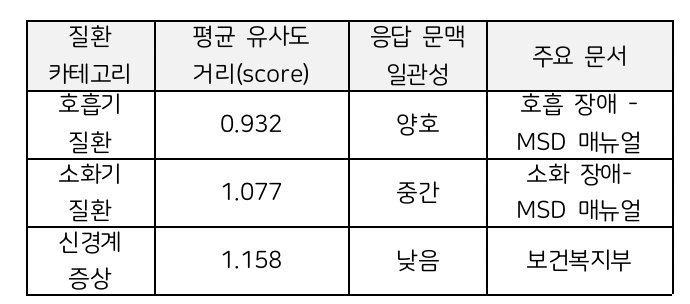

# Medical-LLM-Assistant

> A GPT-4o-based medical consultation RAG system integrating medical document retrieval, symptom-based disease inference, and conversational question answering.

PDF 기반 의료 문서를 외부 지식으로 구축하고, 사용자의 증상 및 질의와 관련된 의료 정보를 검색한 뒤 이를 GPT-4o의 context로 활용하여 답변을 생성하는 **RAG (Retrieval-Augmented Generation) 기반 의료 상담 시스템**입니다.

단순한 의료 질의응답을 넘어, 사용자의 증상 정보가 부족한 경우 추가 질문을 생성하고, 수집된 증상 정보를 바탕으로 질병 후보를 추론할 수 있도록 **의료 문서 검색과 AI 기반 질병 예측 기능을 결합**했습니다.

본 프로젝트에서는 의료 문서 전처리부터 임베딩, FAISS 기반 벡터 검색, 검색 결과 기반 GPT-4o 응답 생성, 대화 문맥 유지 및 검색 결과 평가까지 **End-to-End Medical RAG Pipeline**을 설계하고 구현했습니다.

---

## Project Overview

### Motivation

의료 질의응답에서는 일반적인 LLM의 사전 학습 지식에만 의존하기보다, 신뢰할 수 있는 의료 문서를 검색하고 이를 근거로 답변을 생성하는 과정이 중요합니다.

본 프로젝트에서는 MSD Manual 기반 의료 문서를 외부 지식으로 구축하고, 사용자의 증상 및 질문과 의미적으로 관련된 문서를 검색하여 GPT-4o에 context로 제공하는 RAG 구조를 구현했습니다.

또한 실제 상담 상황을 고려하여 사용자의 입력 정보가 부족할 경우 추가 질문을 수행하고, 수집된 증상 정보를 바탕으로 질병 후보를 추론할 수 있도록 설계했습니다.

이를 통해 **Medical Document Retrieval + Disease Inference + LLM-based Explanation**을 결합한 의료 상담 시스템을 구축했습니다.

---

## Objectives

- 의료 PDF 문서의 전처리 및 검색 가능한 데이터 구축
- 의료 문서의 텍스트 임베딩 및 벡터 저장소 구축
- 사용자 증상 및 질의와 관련된 의료 정보 검색
- 검색된 의료 문서를 기반으로 한 GPT-4o 답변 생성
- 증상 정보가 부족한 경우 추가 질문을 통한 정보 보완
- 사용자 증상 기반 질병 후보 추론
- 대화 문맥을 유지하는 Conversational Memory 구현
- 검색 결과의 관련성 및 응답의 일관성 평가
- End-to-End 의료 상담 RAG Pipeline 구현
- 사용자 인터페이스 구현

---

## System Architecture

```text
Medical PDF Documents
        ↓
Document Loading
        ↓
Text Extraction & Cleaning
        ↓
Text Splitting
        ↓
Text Embedding
        ↓
FAISS Vector Store
        ↓
User Symptoms / Query
        ↓
Query Analysis
        ↓
Additional Questions
        ↓
Query Embedding
        ↓
Similarity Search
        ↓
Retrieved Medical Documents
        ↓
Context Construction
        ↓
Disease Inference
        ↓
GPT-4o Prompt
        ↓
Medical Explanation
        ↓
Conversational Response
````

---

## Workflow

### 1. Medical Document Processing

MSD Manual 기반 의료 PDF 문서를 질의응답에 활용할 수 있도록 전처리했습니다.

`PyPDFLoader`를 이용하여 PDF 문서를 불러오고 텍스트를 추출한 후, 검색 가능한 형태로 정제 및 구성했습니다.

---

### 2. Text Splitting & Embedding

전처리된 의료 문서를 검색 단위로 분할한 후 OpenAI의 `text-embedding-3-small` 모델을 이용하여 각 text chunk의 벡터 임베딩을 생성했습니다.

이를 통해 사용자의 질문과 의료 문서 간의 의미적 유사도를 기반으로 검색할 수 있도록 구성했습니다.

---

### 3. Vector Store

생성된 문서 임베딩을 **FAISS Vector Store**에 저장했습니다.

FAISS를 활용하여 사용자의 질문과 의미적으로 관련성이 높은 의료 문서를 효율적으로 검색할 수 있도록 벡터 검색 구조를 구현했습니다.

---

### 4. Symptom-based Questioning

사용자가 제공한 증상 정보가 충분하지 않은 경우, 추가적인 질문을 통해 필요한 정보를 보완하도록 설계했습니다.

이를 통해 단순히 사용자의 첫 번째 입력만으로 답변을 생성하는 것이 아니라, **대화형 질문 흐름을 통해 증상 정보를 단계적으로 확보**할 수 있도록 구성했습니다.

---

### 5. Similarity Search

사용자의 질문을 embedding space로 변환한 후 FAISS를 이용하여 관련성이 높은 의료 문서를 검색합니다.

검색된 문서는 이후 GPT-4o가 답변을 생성할 때 활용되는 **context**로 전달됩니다.

---

### 6. Disease Inference

수집된 사용자의 증상 정보를 바탕으로 관련 질병 후보를 추론하도록 구성했습니다.

질병 추론 결과는 검색된 의료 문서와 함께 활용하여, 단순한 질병명 제시에 그치지 않고 관련 의료 정보를 자연어로 설명할 수 있도록 설계했습니다.

---

### 7. LLM-based Medical Response

검색된 의료 문서와 사용자 증상 및 질문을 GPT-4o에 전달하여 의료 정보를 설명하는 자연어 답변을 생성합니다.

검색된 외부 의료 문서를 context로 활용함으로써 **LLM의 자체 지식에만 의존하지 않고 근거 문서를 기반으로 답변을 생성하는 구조**를 구현했습니다.

---

### 8. Conversational Memory

사용자와의 지속적인 상담을 위해 이전 대화의 문맥을 유지할 수 있는 Memory 기능을 포함했습니다.

이를 통해 여러 차례의 질문과 답변 과정에서도 이전 증상 및 대화 내용을 고려할 수 있도록 구성했습니다.

---

### 9. Web Interface

사용자가 증상 및 질병 관련 질문을 입력하고, AI의 질문과 의료 정보 기반 답변을 확인할 수 있는 웹 인터페이스를 구현했습니다.

---

## Core Technologies

### Retrieval-Augmented Generation

본 시스템은 **Retrieval**과 **Generation**을 결합한 RAG 구조로 구성되어 있습니다.

```text
User Query / Symptoms
        ↓
Query Embedding
        ↓
Medical Document Retrieval
        ↓
Relevant Medical Context
        ↓
Disease Inference
        ↓
GPT-4o
        ↓
Medical Explanation
```

사용자의 질문 및 증상과 관련된 의료 문서를 검색하고, 검색된 정보를 GPT-4o의 context로 제공하여 답변을 생성합니다.

---

### FAISS

FAISS를 이용하여 벡터화된 의료 문서와 사용자 질의 간의 유사도를 기반으로 관련 문서를 검색했습니다.

이를 통해 의료 문서를 실시간 질의응답 과정에서 활용할 수 있도록 벡터 검색 구조를 구축했습니다.

---

### LangChain

LangChain을 활용하여 문서 로딩, 텍스트 분할, 임베딩, 벡터 검색 및 LLM 호출 과정을 연결하고 전체 RAG pipeline을 구성했습니다.

---

## Experimental Setup

| Component       | Technology               |
| --------------- | ------------------------ |
| LLM             | GPT-4o                   |
| Embedding       | `text-embedding-3-small` |
| Vector Store    | FAISS                    |
| Framework       | LangChain                |
| Document Loader | PyPDFLoader              |
| PDF Processing  | PyMuPDF                  |
| Language        | Python                   |

---

## Evaluation

증상 및 질병 관련 테스트 질의를 구성하여 **검색된 의료 문서의 관련성, 답변의 일관성 및 질의응답 흐름**을 확인했습니다.

또한 `similarity_search_with_score`를 활용하여 사용자 질의와 검색 문서 간의 유사도 거리를 분석했습니다.

실험 결과, 질환 카테고리별 평균 검색 거리는 다음과 같이 나타났습니다.



검색 결과를 통해 질환 유형에 따라 사용자 증상과 의료 문서 간의 검색 관련성이 달라질 수 있음을 확인했습니다.

> **Note:** Similarity score의 절대값은 사용한 distance metric 및 검색 설정에 따라 달라질 수 있으므로, score 자체를 의료 답변의 정확도를 나타내는 절대적인 성능 지표로 해석하기보다 검색 결과의 관련성을 분석하는 기준으로 활용했습니다.

---

## My Contributions

* 의료 상담 시스템 기획 및 전체 RAG pipeline 설계
* 의료 PDF 문서 전처리 및 검색 데이터 구축
* 문서 chunking 및 embedding pipeline 구현
* FAISS 기반 벡터 검색 구현
* LangChain 기반 RAG pipeline 구축
* 사용자 증상 기반 질의응답 흐름 설계
* 부족한 증상 정보를 보완하기 위한 추가 질문 구조 구현
* 검색 결과와 GPT-4o를 연결하는 context 구성 및 prompt 설계
* GPT-4o 기반 의료 정보 설명 및 응답 생성 구현
* Conversational Memory를 활용한 대화 문맥 유지
* 사용자 인터페이스 구현
* 테스트 질의를 통한 검색 및 답변 결과 검증
* Similarity score 기반 검색 결과 관련성 분석

---

## Limitations

본 시스템은 의료 정보 탐색 및 상담을 보조하기 위한 연구용 프로토타입으로, 실제 의료 전문가의 진단이나 판단을 대체하지 않습니다.

또한 다음과 같은 한계가 존재합니다.

* 의료 문서의 최신성 및 데이터 범위에 따른 한계
* 사용자의 다양한 자연어 증상 표현에 대한 대응 한계
* 의료 전문가의 임상적 판단과 AI 추론 결과 간의 차이
* 국내 의료 환경에 특화된 데이터 및 모델 부재
* 의료 전문가의 검증을 통한 추가적인 평가 필요

향후에는 국내 의료 환경에 적합한 데이터셋 구축, 도메인 특화 모델 적용 및 의료 전문가의 피드백을 반영한 평가 체계를 통해 시스템의 신뢰성과 정확성을 개선할 수 있습니다.

---

## Tech Stack

**Language**

* Python

**LLM & RAG**

* GPT-4o
* LangChain
* RAG
* Prompt Engineering

**Retrieval**

* FAISS
* OpenAI Embeddings

**Document Processing**

* PyMuPDF
* PyPDFLoader

